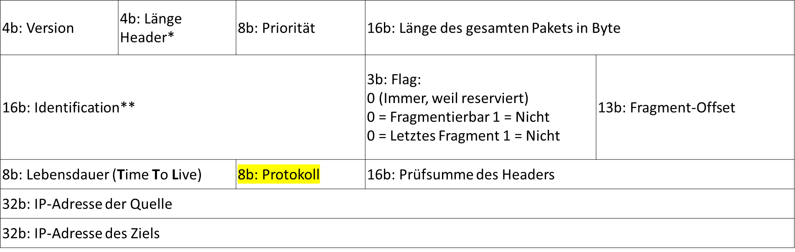
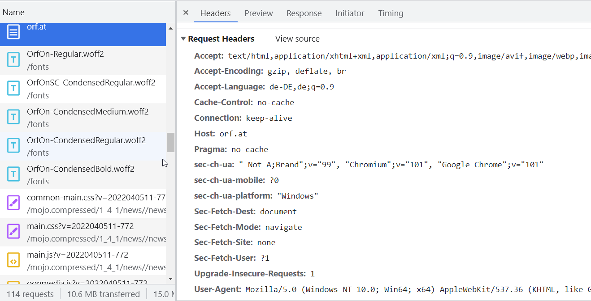
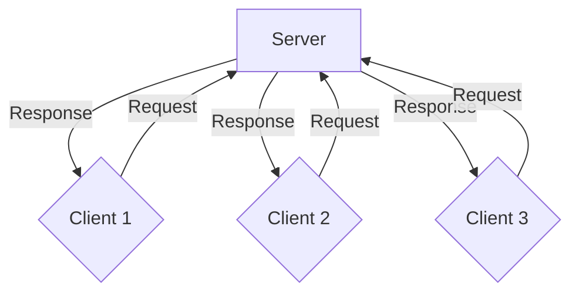
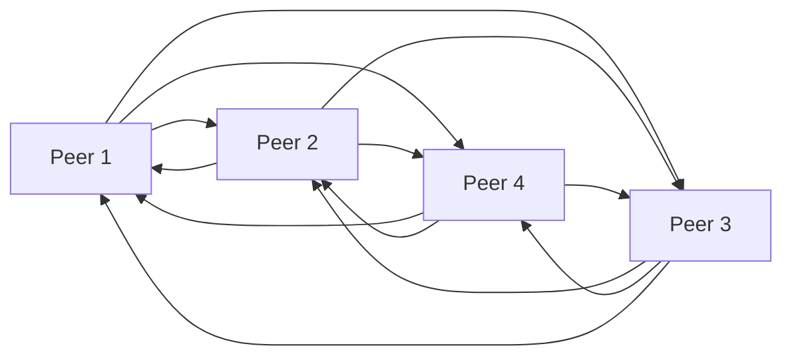
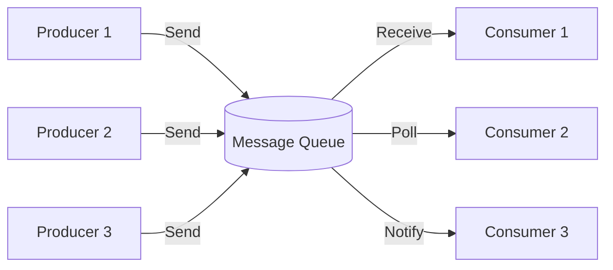
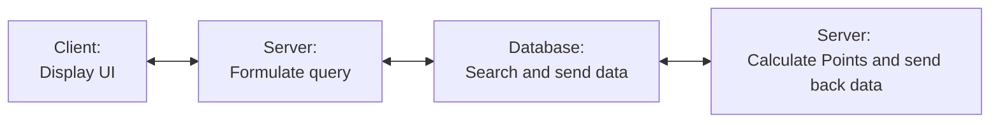

# Cloud Computing

DI Simon A. T. Jiménez, MA

Ideen und Konzepte von Cloud Computing & verteilten Systemen

---

# Vorlesung 1

* __Ideen und Konzepte hinter Cloud Computing aufzuzählen und zu erklären__
* die Betriebsmodelle IaaS, PaaS, FaaS und SaaS zu verstehen und zu beschreiben
* für eine gegebene Problemstellung eines der Betriebsmodelle auszuwählen
* ein No-Code Projekt umzusetzen

---
layout: center
---

There is no cloud. It's just someone else's computer.


---

# Ideen und Konzepte

* Was ist ein verteiltes System?
  * schon eines gesehen? benutzt?
* Wodurch ist ein verteiltes System charakterisiert?

---

# Ideen und Konzepte

* Was ist ein verteiltes System?
  * Internet
  * Meta, Instagram, Google, ...
  * Autos
  * Datencenter
  * Handynetz
  * Stromnetz

---

# Ideen und Konzepte

* Was ist ein verteiltes System?
  * ein Computer
  * eine CPU (Multi-Core!)
  * eine GPU (Multi-Core!)
  * eine Smart Watch, ein Handy,...
  * ~~Bienenschwarm~~

---

# Ist doch alles kein Problem...
The Eight Fallacies of Distributed Systems

- The network is reliable
- Latency is zero
- Bandwidth is infinite
- The network is secure
- Topology doesn't change
- There is one administrator
- Transport cost is zero
- The network is homogeneous

---

# Weitere Probleme
- Mutual Exclusion
- Election (One Leader)
- Naming

---

# Mutual Exclusion (Mutex, 'Wechselseitiger Ausschluss')

*Bekannt von Betriebssysteme?*
- Wie kann man sicherstellen dass das Buch mit der limitierten Auflage von 1 nur einmal verkauft wird?
- Wie kann man sicherstellen dass die Sportveranstaltung mit den 50 limitierten Startplätzen nicht zu oft verkauft wird?
- Wie kann man sicherstellen dass das Konzert mit 50.000 Karten nicht zu oft verkauft wird?

---

# Mutual Exclusion (Mutex, 'Wechselseitiger Ausschluss')

*... Performant? Ohne Komplexität?*
- Am einfachsten: Auf einer Maschine, ein Prozessor, ein Thread
  - Sogar eine Smartwatch hat Threads..
- Dann: Ein Ausführender
- mehrere Ausführende, exklusive Bereiche (500-1000?)
- mehrere Ausführende, Transaktionen/Updates (Yay Datenbank!)
- mehrere Ausführende, Locks (Key/Value)

---

# Mutual Exclusion (Mutex, 'Wechselseitiger Ausschluss')

- Ansatz: Shoppingcart (Hodor)
  - Nähkästchen, nicht Prüfungsrelevant

---

# Mutual Exclusion (Mutex, 'Wechselseitiger Ausschluss')

*... Performant? Ohne Komplexität?*
- Dann: Ein Ausführender
  - Ansatz: Ein fixer Thread
  - Ansatz: Queues
    - SQS, RabbitMQ, Kafka, Datenbanken
  - und sonst?

---

# Election

*One Source of Truth*
- Eine Node wird dynamisch zum Anführer gekührt
- Diverse Möglichkeiten
  - Locking, Messaging...
- Herausforderungen:
  - Skalierung, Komplexität
    - Was passiert, wenn 2 nicht antworten (Split-Brain),...

---

# Naming
<style>
li {
 font-size: 0.87em;
}
</style>
*One name for one thing*
- URL - Uniform Resource Locator
- Ist das in der Cloud noch wichtig?
- Es gibt nicht mehr "server01.corporation.com" oder www03 oder sql17..
  - außer wenn es sie gibt. Ist aber (in echter Cloud-Betrachtungsweise) sehr selten sinnvoll.
- Wie lauft das normal? Ergibt www.google.de etwa 12.34.56.78?
- Normalerweise werden Ressourcen in einer Gruppe zusammengefasst, die verwaltet wird
  - Mehr dazu später (Stichwort Load Balancing, DNS, ALIAS, ...)

---

# Timing

*Ain't nobody got time for that*
- Braucht man noch eine Zeit?
- Wichtiger denn je, dass die Zeiten der Computer Synchronisiert sind
- Wer war zuerst da? Waren Ereignisse gleichzeitig?
- Im Normalfall kann man sich dabei auf den Cloud Provider verlassen, da das der zugrundeliegende Host weiß

---

# Consistency
*Alle haben die gleiche Information?*

- Ist auf einmal ein Riesenproblem
- Was kann schiefgehen?
  - Zeitverzögerung
  - Paketverluste
  - Schreibkonflikte (wer hat Recht?)
- Mechanismen sind komplex, keiner ist perfekt

---

# Replication
*Seven Horcruxes ain't enough*

- Kopien müssen verteilt werden
- ..konsistent und am besten gleichzeitig
  - geht das?
  - Short answer: no, we have to cope somehow

---

# Fault tolerance
*So it needs more than one iceberg*

- Fehler müssen erwartet werden
- Es muss klar verstanden werden, was passieren kann und was dadurch weiter passieren kann
- Fehlerresistente Software bauen!
  - Wie kann das gehen? Ideen?
  - Schonmal Fehler in (Cloud-)Software gesehen, die sich selbst repariert hat?

---

# Computer Networks
*that always work*

- Wir gehen in diesem Kurs von einem immer funktionierenden Netzwerk aus
- Das wäre sonst zu Umfangreich und hätte in jedem Satz ein `"What if?"`
- Dass das nie so ist merkt man jeden Tag
- Nicht nur das WLAN und Handynetz ist instabil, auch per Kabel gehen Informationen verloren

---

# Cloud Computing
*rounding up*

- Worum geht es also?
- Warum ist das Internet so wie es ist (tlw. Wiederholung)
- Warum sind große Firmen so aufgebaut wie sie sind und wie kann das funktionieren (Netflix, Amazon,...)
- Mechanismen, Konzepte, kleine Proof of Concepts
  - Die an der Oberfläche des möglichen kratzen

---
layout: center
---

# Fragen?

---

# Vorlesung 1
*Still here*
* __Ideen und Konzepte hinter Cloud Computing aufzuzählen und zu erklären__
* die Betriebsmodelle IaaS, PaaS, FaaS und SaaS zu verstehen und zu beschreiben
* für eine gegebene Problemstellung eines der Betriebsmodelle auszuwählen
* ein No-Code Projekt umzusetzen

---

# Ideen und Konzepte
*Wisst ihr noch alles, oder?*
* Kurze Wiederholung
  * Netzwerk
  * Internet
  * DNS
  * TCP

---

# Netzwerk
*Schichten, Oger haben Schichten*
* Schichten: OSI
  * Welche fallen euch noch ein?

---

# Netzwerk
* Schichten: OSI
  * Application Layer
  * Transport Layer
  * Internet Layer
  * Link layer

---

# Netzwerk
* Schichten: OSI -> IP
  * Warum braucht es IP?
  * Warum reicht Layer 2 nicht (MAC)?
  * Warum reicht TCP nicht, HTTP,...?

---

# Netzwerk
* Schichten: Protokolle
  * Was ist ein Protokoll?
    * Encoding, Byte ordering
    * Little endian, big endian
    * Start vom Paket, Länge
    * Checksum
    * Format der Adresse

---

# Netzwerk
* Schichten: OSI
  * Layer 1: Physische Kommunikation
    * Elektronik
      * Volt
      * Abtastrate
      * Modulation
      * Verbindungen

---

# Netzwerk
* Schichten: OSI
  * Layer 2: Lokale Kommunikation
    * Erkennt und korrigiert Fehler
    * Verschickt und empfängt Pakete
    * Große/Kleine Pakete
    * MAC-Adressen

---

# Netzwerk
* Schichten: OSI
  * Layer 3: Netzwerk (IP)
    * Routeninformationen, Versand
    * Kann über verschiedene Netzwerke durchgehen
    * Ermöglicht Kommunkation mit der ganzen Welt

---

# Netzwerk
* Schichten: OSI
  * Layer 4: Netzwerk (IP)
    * Konsistentes Interface für Kommunikation
    * Stauverfahren, Flusskontrolle
    * Post: "Schicke das an Herrn Maier"

---

# Netzwerk
* Schichten: OSI
  * Layer 5-7: Application-Layer
    * Vermischt sich etwas:
    * Layer 5: Session (HTTP, SSL) - wer redet mit wem
    * Layer 6: Datenrepräsentation - was bedeutet was
    * Layer 7: Applikation - was bedeutet das alles für diese Applikation


---

# Network Example
*Not meant to be correct*
```mermaid {theme: 'neutral', scale: 0.4, 'themeVariables': { 'primaryColor': '#000000'}}
graph TD
A[Hosting Center 1] --> C{Backbone ISP 3}
B[Hosting Center 2] --> C
A[Hosting Center 1] --> G{Backbone ISP 2}
B[Hosting Center 2] --> G
A[Hosting Center 1] --> H{Backbone ISP 1}
B[Hosting Center 2] --> H
C --> D[IX]
C --> E[IX]
G --> D[IX]
G --> E[IX]
H --> I[IX]
H --> E[IX]
C --> I[ISP 1]
C --> J[ISP 3]
C --> K[ISP 2]
D --> I
D --> K
I --> M[S]
I --> N[S]
I --> O[S]
J --> P[S]
J --> Q[S]
J --> R[S]
K --> S[S]
K --> T[S]
K --> U[S]
C --> X[S]
```

---

# Network Example: ISPs

Was sehen wir?
* Netzwerk: Eine Sammlung von Hosts, Verbindungen, Routern,..
* S = Site -> Ein Netzwerk, das z.B. ein Heimnetzwerk oder Firmennetzwerk ist
* Zwischen den Netzwerken gibt es Firewalls und NAT Tools
* ISP ist ein Internet Service Provider, der dafür sorgt das man ins Internet kommt

---

# Network Example: ISPs
<style>
li {
 font-size: 0.9em;
}
</style>
* Backbone ISP ist ein Transit-Netzwerk, das eigenen Protokollen folgt (BGP,...) und die ISPs miteinander verbindet
* Eine Site kann auch direkt an einem Backbone hängen, wenn das ausverhandelt ist
* IX - Inter-Exchange (peering point)
  * Verbindungen zwischen ISPs, Routing-Station, z.B. https://www.vix.at/, https://www.grax.at/
* Hosting-Center
  * z.B. Hetzner, AWS, Google, ...

---

# Network Example: ISPs

* Bilaterales Peering: Direkte Verbindungen zwischen den Backbone ISPs
  * Auch nur ein fancy Name für: Sehr große ISPs (Tier 1), Große ISPs (Tier 2), normale ISPs (Tier 3)
* Tier 1: Hat direkten Zugriff zur gesamten Region, z.B. Deutsche Telekom, A1, AT&T
* Tier 2: Kauft sich bei Tier 1 ein (Drei, Vodaphone,...)
* Tier 3: Kauft sich bei Tier 2 ein (Citycom,...)

---

# Protokolle

* Protokolle müssen darauf hinweisen, welches Protokoll als nächstes folgt
* Erinnerung: TCP / Ports

---

# Protokolle: TCP

* Bietet „Garantie“, dass Pakete ankommen
* Pakete werden nummeriert, nur komplette Daten kommen an
* Ein Port pro Anwendung
  * z.B. 192.168.0.1:15000
* Verbindungsaufbau muss erfolgen bevor Daten übertragen werden können

---

# Protokolle: TCP
<style>
li {
 font-size: 0.87em;
}
</style>
* Zusatzerklärung: „Hört auf“ „Listens to“
* Generell spricht man davon, dass ein Programm auf einem Port „hört“ -> „listens“
* Ein Server mit 192.168.0.1 hat natürlich immer auch die 127.0.0.1
* Dass ein Server auf 127.0.0.1:4000 hört, heißt nicht unbedingt dass der Server auf 192.168.0.1:4000 hört
* Ein Server kann auf einem Interface Programm A und auf dem anderen Interface Programm B aktiviert haben – am selben Port, aber auf einer anderen IP-Adresse
* Bspw. kann ein Server viele Netzwerkkarten haben, oder auch auf eine Netzwerkkarte mehrere IP-Adressen binden

---

# Protokolle: TCP - Ports

* 0-1023: Well Known Ports – Reserviert
* 1024-49151: Registered Ports (IANA, ICANN)
* 49152-65535

Der Port wird im TCP bzw. UDP – Header angegeben


---

# Protokolle: TCP - Ports



---

# Protokolle: "Demultiplexing fields"

* Also: Ethernet sagt, ob es IPv4 oder IPv6 ist
* IP sagt die Protokollnummer, obs z.B. TCP, UDP, SCTP... ist
* TCP, UDP: Portnummer
  * sagt ob es FTP, SMTP, HTTP,... ist
* HTTP: Host field
  * Sagt, welcher Web Server gemeint ist


---

# Protokolle: "Demultiplexing fields"
*Who you think you talkin to*



---

# Protokolle: "Demultiplexing fields"
*Why do you tell this*

* Ein Server kann ja z.B. mehrere Seiten haben
* Wie soll denn z.B. ein reverse proxy wissen, was er ausliefern soll?
  * -> Load Balancer, Caches
* Da sind wir aber noch nicht.. vorher noch ein paar Grundlagen
  * -> Verteilte Systeme

---

# Verteilte Systeme
*You know when you have one when the failure of a computer you’ve never heard of stops you from getting any work done (L.Lamport)*


Besteht aus...
* Komponenten, die Arbeiten erledigen
* Kommunikationsmechanismen

---

# Verteilte Systeme: Client-Server

---

# Verteilte Systeme: Peer-to-Peer


---

# Verteilte Systeme: Komponenten

* __Entitäten | Komponenten | Module__
* Kommunikationsmechanismen
* Rollen und Verantwortung
* Platzierung

---

# Verteilte Systeme: Entitäten

* Systeme
  * Prozesse
  * Threads
  * Nodes
  * Ev. ganze Server/Systeme als Komponente

---

# Verteilte Systeme: Komponenten

* Entitäten | Komponenten | Module
* __Kommunikationsmechanismen__
* Rollen und Verantwortung
* Platzierung

---

# Verteilte Systeme: Kommunikation
*z.B. Client und Server*
* Frontend und Backend kommunizieren über...
  * HTTP(S) - APIs, Websockets
  * --> Direkte Verbindung!
  * Wir müssen im Vorhinein wissen wo genau wir hinmüssen (Adresse der API)
  * Es muss ein Server auf die Verbindung warten (Webserver)

---

# Verteilte Systeme: Kommunikation
*Man in the middle*

Indirekte Kommunikation benutzt Middleware für:
- Kommunikation einer-mit-vielen (Proxys aller Art)
- Sender und Empfänger müssen nichts voneinander wissen
- Sender und Empfänger müssen keine direkte Verbindung zueinander aufbauen
  - SSL Termination, TCP Termination,...

---

# Verteilte Systeme: Kommunikation
*Typen*

* __Gruppenkommunikation, Reverse Proxys aller Art__
* Publish & Subscribe (PubSub)
* Message Queues

---

# Verteilte Systeme: Kommunikation
*Typen: One-To-Many*

* Multicast (TCP-Ebene oder als __Konzept__)
* Einer sendet, viele empfangen
* z.B. Push-Notifications, Websockets
* Systeme wie API Gateway (u.A. Websockets)

Effiziente Nutzung der Bandbreite bis zur Middleware (Eine Nachricht wird erst dort multipliziert)

---

# Verteilte Systeme: Kommunikation
*Typen: One-To-Many*

* Multicast (TCP-Ebene oder als __Konzept__)
* Reverse Proxy
  * Einer fragt an, viele bekommen die gleiche Antwort

Effiziente Benutzung der Berechnungsressourcen (Einmal berechnen reicht für viele)

---

# Verteilte Systeme: Kommunikation
*Typen*

* Gruppenkommunikation, Reverse Proxys aller Art
* __Publish & Subscribe (PubSub)__
* Message Queues

---

# Verteilte Systeme: Kommunikation
*Typen: One-To-Many: Push-Notification*

* Alle/Eine Gruppe/Einzelne bekommen eine Nachricht
  * Können Clients oder andere Services sein
  * Nachricht kann alles relevante enthalten `{message: 'Hi! ❤', sender: 'Honeybunny', time: 1337}`
  * oder nur Informationen wie `new news, check yourself`

---

# Verteilte Systeme: Kommunikation
*Typen: One-To-Many: Push-Notification*

* Wie lange geht das "naiv" gut?
  * z.B.: Eine Nachricht an alle Instagram-Benutzer
  * Einfach auf einem Computer laufen lassen, bis alle die Nachricht bekommen haben?
  * Was passiert bei einem Absturz, ...?
    * Desaster recovery: Einfach nochmal alle losschicken?
    * Load balancing: Sharding?

---

# Verteilte Systeme: Kommunikation
*Typen*

One-To-Many
* Middleware kümmert sich z.B.
  * um die Gruppenzugehörigkeit
  * Verbindungsaufbau/Abbau
  * Einzelne können das "Gesamte" weniger stören

---

# Verteilte Systeme: Kommunikation
*Typen*

* Gruppenkommunikation, Reverse Proxys aller Art
* Publish & Subscribe (PubSub)
* __Message Queues__

---

# Verteilte Systeme: Kommunikation
*Typen: One-To-Many: Message Queues*

* Message Queues to the rescue
  * Producer: Schreiben eine Nachricht oder viele Nachrichten in eine Queue
  * Nachrichten werden an die Kunden durch div. Methoden weitergeschickt
  * Queue sorgt dafür, dass die Nachrichten ankommen

Vorteile: Space decoupling, time decoupling

---

# Verteilte Systeme: Kommunikation
*Typen: One-To-Many: Message Queues*

* Gesamt: das mächtigste und wichtigste Konzept in der Cloud
* PubSub sind "optimistische" Message Queues
  * Wenn man nur davon ausgeht, dass eh alles gut geht, ist PubSub besser, da sofortig
  * Die genaue Grenze ist diskussionswürdig


---

# Verteilte Systeme: Kommunikation
*Typen*



---

# Verteilte Systeme: Kommunikation
*Typen*

Also:
* Nodes, Prozesse, Threads oder ganze Systeme

kommunizieren über
* Sockets, HTTP,...
* direkt oder über Middleware (Gruppen, PubSub, Queues)

---

# Verteilte Systeme: Komponenten

* Entitäten | Komponenten | Module
* Kommunikationsmechanismen
* __Rollen und Verantwortung__
* Platzierung

---

# Verteilte Systeme: Rollen
*Level 9 Cleric*

Rollen zum Verständnis der Aufgaben
* Hat das Smartphone die gleiche Aufgabe wie ein Google Search Cluster?

Wir klassifizieren (erstmal) in
* Client & Server
* Peer-to-peer

---

# Verteilte Systeme: Rollen
*Client-Server Architecture*

Zugang:
* Der Server stellt etwas zur Verfügung
* Der Client fragt etwas an, der Server antwortet

Beispiele: DNS, Web,...

---

# Verteilte Systeme: Rollen
*Client-Server Architecture*

Vorteile:
* Einfach, zentralisierte Kontrolle
* Aufgaben die viel Rechenleistung benötigen können vom Server erledigt werden, erlaubt "thin clients", schwache Endgeräte

Nachteile:
* Single point of failure
* Skalierbarkeit

---

# Verteilte Systeme: Rollen
*Peer-to-Peer*

Vorteile:
* Alle Nodes sind gleichwertig
* Aufgaben können aufgeteilt werden

Nachteile:
* Keine zentralisierte Kontrolle
* Fairness?

---

# Verteilte Systeme: Rollen
*Kann es das gewesen sein?*

Design Patterns
* Gibt es natürlich auch hier
* Primitive Elemente und Einteilungen können in verschiedene Patterns kombiniert werden
  * Mehrstufige Systeme (Tiered)
  * Layers

---

# Verteilte Systeme: Rollen
*Kann es das gewesen sein?*

* Tiered Architecture und Layering sind komplementär
  * Layering = Ebenen, vertikale organisation
  * Tiered Architecture = horizontale Aufteilung

---

# Verteilte Systeme: Rollen
*It's a classic*

Tiered Architecture
* Der Klassiker: Three-Tier-Architecture


---

# Verteilte Systeme: Rollen
*It's a kind of magic*

Tiered Architecture
* Kann aber auch komplexer sein



---

# Verteilte Systeme: Rollen
*It's a kind of magic*

Ein komplexes System wird in Layer unterteilt.
* Die oberen Layer verwenden die Services der unteren Layer.
* Die Komplexität der unteren Layer kann in den oberen ignoriert werden
* Kontrollfluss durch die Layer

---

# Verteilte Systeme: Rollen

* Plattform
  * Hardware, Low-Level Software layers
* Middleware
  * Kommunikationsmechanismen werden verwendet
* Applikationen
  * Browser, Spotify,...

Deswegen sind z.B. auch Bankomaten keine komplette Neuerfindung, sondern einfach nur Computer

---

# Verteilte Systeme: Rollen
<style>
li {
 font-size: 0.65em;
}
</style>
In einer Applikation muss man sich sehr bewusst sein, was man benutzt und worauf man sich verlässt.
* Die Layer unter einer Software sind immer da, man kann sich nur auf sie verlassen
* ...oder muss
* z.B.: [OVH Feuer in Straßburg](https://corporate.ovhcloud.com/en-ie/newsroom/news/informations-site-strasbourg/)
* oder auch https://www.wiz.io/blog/chaosdb-how-we-hacked-thousands-of-azure-customers-databases/
* oder https://www.wiz.io/blog/wiz-research-discovers-extrareplica-cross-account-database-vulnerability-in-azure-postgresql/
* oder https://www.zdnet.com/article/unsecured-aws-server-exposed-airport-employee-records-3tb-in-data/
* oder https://www.wiz.io/blog/azure-app-service-source-code-leak
* ...

---

# Verteilte Systeme: Komponenten

* Entitäten | Komponenten | Module
* Kommunikationsmechanismen
* Rollen und Verantwortung
* __Platzierung__

---

# Verteilte Systeme: Komponenten

Platzierung der Services
* Was läuft wo?
  * Bare-Metal? PaaS? FaaS,...?
* Verschiedene Strategien
  * Viel Power auf einem Host (Vertikal Skalieren)
  * Wenig Power auf vielen Hosts (Horizontal Skalieren)
  * Thin Client - Fat Client

---

# Verteilte Systeme: Komponenten

Platzierung der Services
* Jetzt gibt es ja Datenzentren überall auf der ganzen Welt...
* ...neuer Server in Deutschland, schnell rüberkopieren, dann nach Amerika kopieren,...
* ...wie kommen die Daten dorthin wo sie gehören?
* Große, statische Daten:
  * Einfach, dafür gibt es CDN (Content Delivery Network) Dienste (z.B. CloudFront, CloudFlare, Akamai,...)

---

# Verteilte Systeme: Komponenten

Platzierung der Services
* Viele kleine Daten
  * Brauchen jedes mal eine eigene Strategie?
  * Oder gibt es dafür Services?
    * DynamoDB (AWS), Cosmos DB (Azure), Cloud Spanner (Google), AWS Aurora...

---

# Verteilte Systeme

* Grundzüge von Cloud Computing
  * Gründzüge von verteilten Systemen (done)
  * Parallelität (Concurrency) (next Time)
* Erstmal weiter im generellen Plan!
