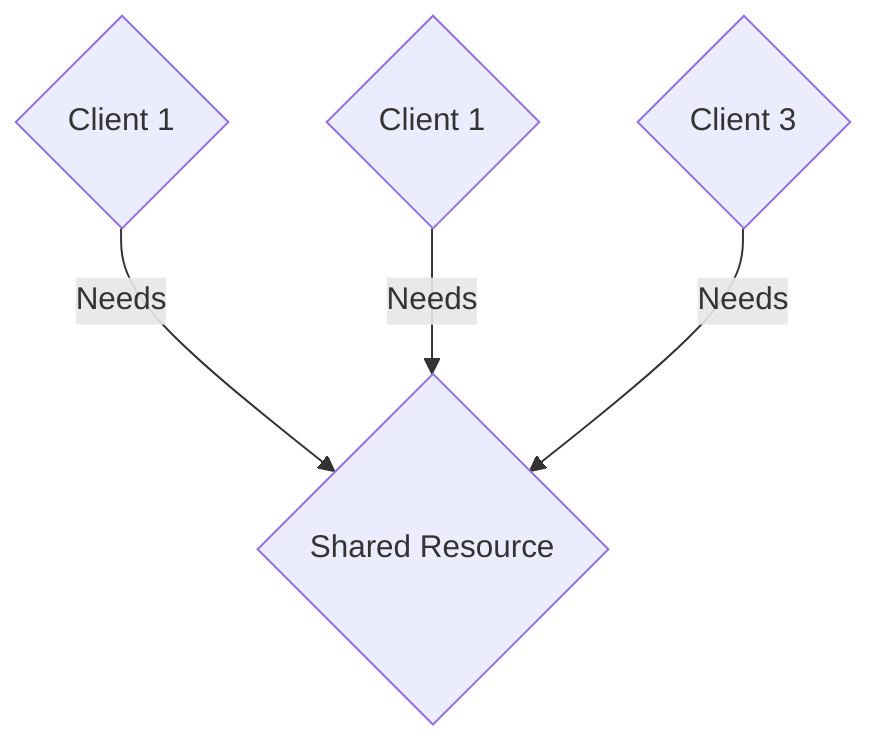
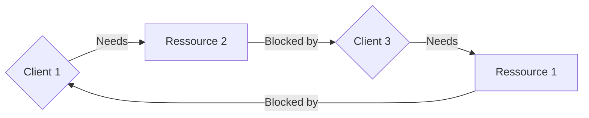

# Cloud Computing

DI Simon A. T. Jiménez, MA

Prozesse und Parallelität (Concurrency)

---

# Vorlesung

* __das CAP-Theorem anhand von Beispielen zu erklären und zu begründen__
* Kategorien von Datenbanken (NoSQL, Key/Value, SQL) zu erklären und voneinander abzugrenzen
* Ansätze zum Skalieren von Anwendungen zu erklären und anzuwenden

---

# CAP-Theorem & Grundlagen

*Problem, 'cap?*

Das CAP-Theorem besagt, dass es in einem verteilten System unmöglich ist, gleichzeitig die drei Eigenschaften **C**onsistency (Konsistenz), **A**vailability (Verfügbarkeit) und **P**artition Tolerance (Ausfalltoleranz) zu garantieren.

* Konsistenz
* Verfügbarkeit
* Partitionstoleranz

... davor aber noch ein paar Grundlagen

---

# Grundlagen: Concurrency

```java
int x = 0, y = 0, z = 0;        

thread A {
 x = y + z;
}
thread B {
  y = 1; z = 2;
}
```

Was kommt dabei für x raus?   
 a) `0`   
 b) `1`    
 c) `3`

---

# Grundlagen: Concurrency

Lösung: Locks!



---

# Grundlagen: Concurrency
<style>
li {
 font-size: 0.9em;
}
</style>
*Dining Philosophers*
 * Reicht nicht aus in verteilten Systemen!
 * Klassisch: Dining Philosophers
 * Ein erfundenes Problem von Dijkstra (1965), das aber echte Lösungen inspiriert
 * Philosophen essen und denken
 * N Philosophen, N Gabeln
 * Zum Essen braucht man 2 Gabeln (gibt Spaghetti)
 * Jeder Philosoph nimmt immer nur eine Gabel auf einmal in eine Hand

---

# Grundlagen: Concurrency
*Dining Philosophers: Spielregeln*

* Die Philosopen wollen ein gültiges Regelset, das alle gleich anwenden
* Sie sind immer hungrig
* Alle sollen gleichberechtigt sein

Was kann da schon schiefgehen.

---

# Grundlagen: Concurrency
*Dining Philosophers: Probleme*

* Starvation: Ein Philosoph kann an Hunger sterben
* Deadlock: Kein Philosoph kann mehr irgendwas machen
* Livelock: Alle machen etwas, niemand etwas sinnvolles

---

# Grundlagen: Concurrency
<style>
li {
 font-size: 0.95em;
}
</style>
* Starvation != Deadlock
  * Starvation: Ein Ausführender wartet für immer
    * z.b. ein Niedrigprioritärer Prozess, während die hochprioritären dauernd die Ressourcen blockieren
  * Deadlock: Jeder wartet auf den nächsten
    * Thread 1 hat Ressource 1 und wartet auf Ressource 2
  * Ein Deadlock führt zu Starvation, aber nicht umgekehrt
    * Starvation kann mal aufhören
    * Ein Deadlock nie, ohne externe Intervention

---


---

# Grundlagen: Concurrency
*Dining Philosophers: Probleme*


---

# Grundlagen: Concurrency
*Dining Philosophers: Probleme*

```c
# define N 5
Philosoph i (0, 1, .. 4)
do {
    think();
    take_fork(i);
    take_fork((i+1)%N);
    eat(); /* nom nom nom */
    put_fork(i);
    put_fork((i+1)%N);
} while (true);
```
---

# Grundlagen: Concurrency
*Dining Philosophers: Probleme*

Lösungen:
* Zentrale Verwaltung: Kellner
  * Skaliert nicht; Single point of failure
* Verteilte Verwaltung: Reden
    * Braucht globalen State - Skaliert nicht
* Verteilte Verwaltung: Wahrscheinlichkeit
    * Per Zufall!

---

# Grundlagen: Concurrency
*Dining Philosophers: Probleme*

 * Nimm eine zufällige Gabel
   * Versuch dann die andere zu bekommen
   * geht? Yay!
   * Nicht? Gib beide zurück
   * repeat

---

# Grundlagen: Mutual Exclusion

Zwei Server in einer Bank

* Jemand hebt von 2 Bankomaten __exakt gleichzeitig__ 1000€ ab
  * Der erste Server holt sich den Kontostand
  * Der zweite Server holt sich den Kontostand
  * Beide ziehen 1000€ ab und schreiben den Stand zurück
  * nice

---

# Grundlagen: Mutual Exclusion

Was muss eine gute Mutual Exclusion bieten?
* Safety
* Liveness
* Ordering

Nein, keiner muss mir die Begriffe auswendig lernen

---

# Grundlagen: Mutual Exclusion

Was muss eine gute Mutual Exclusion bieten?
* Safety
  * Nur ein Prozess kann auf die Ressource zugreifen, z.B. gleichzeitig eine Funktion ausführen, einen Wert lesen oder verändern

---

# Grundlagen: Mutual Exclusion

Was muss eine gute Mutual Exclusion bieten?
* Ordering
    * Im Idealfall (nicht zwingend) bekommen die Anfragenden die Ressource in der Reihenfolge, in der sie angefragt haben

---

# Grundlagen: Mutual Exclusion

Dazu gibt es verschiedene Algorithmen, die wir nicht genau betrachten werden. Prinzipiell gibt es
* Permission based (Anfragebasiert, normalerweise benutzt) und
* Token based (Mit Zugriffstoken, der reihum weitergereicht wird)
* Dazu gibt es zentralisierte Ansätze und dezentralisierte Ansätze

---

# Grundlagen: Mutual Exclusion

* Der Grund, warum es wenig (keine?) technische Lösungen für gleichzeitigen globalen Zugriff auf Daten gibt
  * Ich meine: Skalierbar und performant, natürlich gibt es immer Lösungen

---

# Grundlagen: Election

* Öfter muss mal ausgesucht werden, wer was macht
* z.B. wer schreibt die Kontodaten?
* Schlechtes Beispiel, natürlich ist ein Bankkonto prinzipiell Eventbasiert
* d.H. jeder Stand des Bankkontos kann durch die Historie wiederhergestellt werden, es werden nur mehr Transaktionen

---

# Grundlagen: Election

* Was passiert aber, wenn eben dann wirklich geschrieben werden muss, und es zwei Zuständige gibt?
  * Inkonsistenz
* Was passiert, wenn nicht klar ist, wer der Zuständige ist?
  * Inkonsistenz
* Was passiert, wenn der Zuständige abgestürzt ist?
  * Unzuverlässiges System

---

# Grundlagen: Election

* Mehrere Cloud-Server replizieren z.B. eine Datei, einer redet mit dem Kunden
  * Einige Google-Dienste (z.B. Gmail) funktionier(t)en so
  * Vier replicas, eine primary
  * wer hat die primary?
* Mehrere NTP (Zeitgebung)-Server - wer gibt die Zeit an?

---

# Grundlagen: Election

* Ein Prozess für die Election muss erkennen wenn der Leader nicht mehr da ist
  * auch gar nicht SO einfach
  * ...und was dann?

---

# Grundlagen: Election

* Mehrere Calls for Election könnten auf einmal durchgeführt werden
  * Es darf trotzdem nur ein Ergebnis geben
  * Es muss dann EINEN Koordinator geben (Unique - -> __Naming__)
  * z.B. Der Prozess wird der mit der wenigsten Load, am meisten Festplattenplatz,...

---

# Grundlagen: Election

* Es gibt viele Algorithmen, die lassen wir aber aus um uns mehr aufs praktische zu Konzentrieren
* Wens interessiert, sollte sich `Shout` und `Yo-Yo` ansehen

tut_olafl_05_Mut 
seite 34

---

# Grundlagen: Mutual Exclusion

Was muss eine gute Mutual Exclusion bieten?
* Liveness
    * Keine Starvation - jeder der die Ressource anfordert, bekommt sie irgendwann
---

# CAP-Theorem: Konsistenz

---

# CAP-Theorem

Reminder: es geht um
* Konsistenz
* Verfügbarkeit
* Partitionstoleranz
* Oft als Dreieck visualisiert. 
* Es ist nur möglich, zwei der drei Dinge zu schaffen. 
* Man muss sich also in einem Fehler entscheiden - entweder die Daten sind Konsistent oder das System verfügbar.


---

# CAP-Theorem

SQL verfolgt: ACID
* Atomarität
  * Transaktionen werden ganz oder nicht ausgeführt - bei Fehler erfolgt ein Rollback 
* Konsistenz
  * Eine Transaktion hinterlässt immer einen konsistenten State - auch im Fehlerfall 
* Isolation
  * Mehrere Transaktionen beeinflussen sich nicht (Lockings - auf Row Level, Table-Level,...)
* und Dauerhaftigkeit
  * Daten sind garantiert gespeichert (auch wenn die Transaktion noch nicht durchgeführt wurde). Z.B. durch Transaktionslogs.
  
---

# CAP-Theorem
* NoSQL verfolgt: BASE
* Basically available
* Soft state
* Eventual consistency (nicht eventuell, sondern "später mal")

---

# Vorlesung

* das CAP-Theorem anhand von Beispielen zu erklären und zu begründen
* __Kategorien von Datenbanken (NoSQL, Key/Value, SQL) zu erklären und voneinander abzugrenzen__
* Ansätze zum Skalieren von Anwendungen zu erklären und anzuwenden

---

# Vorlesung

* das CAP-Theorem anhand von Beispielen zu erklären und zu begründen
* Kategorien von Datenbanken (NoSQL, Key/Value, SQL) zu erklären und voneinander abzugrenzen
* __Ansätze zum Skalieren von Anwendungen zu erklären und anzuwenden__
