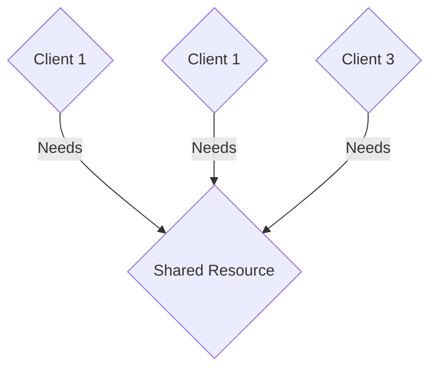
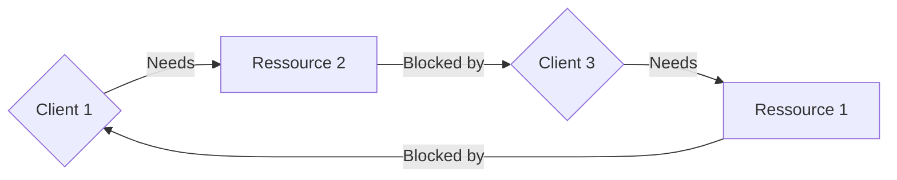

# Cloud Computing

DI Simon A. T. Jiménez, MA

Prozesse und Parallelität (Concurrency)

---

# Vorlesung

* __das CAP-Theorem anhand von Beispielen zu erklären und zu begründen__

---

# CAP-Theorem & Grundlagen

<style>
li, p {
 font-size: 0.9em;
}
</style>
*Problem, 'cap?*

Das CAP-Theorem besagt, dass es in einem verteilten System unmöglich ist, gleichzeitig die drei Eigenschaften **C**onsistency (Konsistenz), **A**vailability (Verfügbarkeit) und **P**artition Tolerance (Ausfalltoleranz) zu garantieren.

* Konsistenz
* Verfügbarkeit
* Partitionstoleranz

... davor aber noch ein paar Grundlagen

---

# Grundlagen: Concurrency

<style>
li, p {
 font-size: 0.9em;
}
.slidev-layout p {
 margin-top: 0rem;
}
</style>
```java
int x = 0, y = 0, z = 0;        

thread A {
 x = y + z;
}
thread B {
  y = 1; z = 2;
}
```

Was kommt dabei für x raus?   
 a) `0`   
 b) `1`    
 c) `3`

---

# Grundlagen: Concurrency

Lösung: Locks!



---

# Grundlagen: Concurrency
<style>
li {
 font-size: 0.9em;
}
</style>
*Dining Philosophers*
 * Reicht nicht aus in verteilten Systemen!
 * Klassisch: Dining Philosophers
 * Ein erfundenes Problem von Dijkstra (1965), das aber echte Lösungen inspiriert
 * Philosophen essen und denken
 * N Philosophen, N Gabeln
 * Zum Essen braucht man 2 Gabeln (gibt Spaghetti)
 * Jeder Philosoph nimmt immer nur eine Gabel auf einmal in eine Hand

---

# Grundlagen: Concurrency
*Dining Philosophers: Spielregeln*

* Die Philosophen wollen ein gültiges Regelset, das alle gleich anwenden
* Sie sind immer hungrig
* Alle sollen gleichberechtigt sein

Was kann da schon schiefgehen.

---
layout:center
---
<style>
img {
 width: 40%;
 margin: auto;
}
</style>


*Benjamin D. Esham / Wikimedia Commons / CC BY-SA 3.0*
---

# Grundlagen: Concurrency
*Dining Philosophers: Probleme*

* Starvation: Ein Philosoph kann an Hunger sterben
* Deadlock: Kein Philosoph kann mehr irgendwas machen
* Livelock: Alle machen etwas, niemand etwas sinnvolles

---

# Grundlagen: Concurrency
<style>
li {
 font-size: 0.95em;
}
</style>
* Starvation != Deadlock
  * Starvation: Ein Ausführender wartet für immer
    * z.b. ein Niedrigprioritärer Prozess, während die hochprioritären dauernd die Ressourcen blockieren
  * Deadlock: Jeder wartet auf den nächsten
    * Thread 1 hat Ressource 1 und wartet auf Ressource 2
  * Ein Deadlock führt zu Starvation, aber nicht umgekehrt
    * Starvation kann mal aufhören
    * Ein Deadlock nie (ohne externe Intervention)

---


---

# Grundlagen: Concurrency
*Dining Philosophers: Probleme*


---

# Grundlagen: Concurrency
*Dining Philosophers: Probleme*

```c
# define N 5
Philosoph i (0, 1, .. 4)
do {
    think();
    take_fork(i);
    take_fork((i+1)%N);
    eat(); /* nom nom nom */
    put_fork(i);
    put_fork((i+1)%N);
} while (true);
```
---

# Grundlagen: Concurrency
*Dining Philosophers: Probleme*

Lösungen:
* Zentrale Verwaltung: Kellner
  * Skaliert nicht; Single point of failure
* Verteilte Verwaltung: Reden
    * Braucht globalen State - Skaliert nicht
* Verteilte Verwaltung: Wahrscheinlichkeit
    * Per Zufall!

---

# Grundlagen: Concurrency
*Dining Philosophers: Lösung*

 * Nimm eine zufällige Gabel
   * Versuch dann die andere zu bekommen
   * geht? Yay!
   * Nicht? Gib beide zurück
   * repeat

---

# Grundlagen: Mutual Exclusion

Zwei Server in einer Bank

* Jemand hebt von 2 Bankomaten __exakt gleichzeitig__ 1000€ ab
  * Der erste Server holt sich den Kontostand
  * Der zweite Server holt sich den Kontostand
  * Beide ziehen 1000€ ab und schreiben den Stand zurück
  * nice

---

# Grundlagen: Mutual Exclusion

Was muss eine gute Mutual Exclusion bieten?
* Safety
* Liveness
* Ordering

Nein, keiner muss mir die Begriffe auswendig lernen

---

# Grundlagen: Mutual Exclusion

Was muss eine gute Mutual Exclusion bieten?
* Safety
  * Nur ein Prozess kann auf die Ressource zugreifen, z.B. gleichzeitig eine Funktion ausführen, einen Wert lesen oder verändern

---

# Grundlagen: Mutual Exclusion

Was muss eine gute Mutual Exclusion bieten?
* Liveness
  * Die Prozesse kommen (irgendwann) auf die Ressource


---

# Grundlagen: Mutual Exclusion

Was muss eine gute Mutual Exclusion bieten?
* Ordering
  * Im Idealfall (nicht zwingend) bekommen die Anfragenden die Ressource in der Reihenfolge, in der sie angefragt haben

---

# Grundlagen: Mutual Exclusion

Dazu gibt es verschiedene Algorithmen, die wir nicht genau betrachten werden. Prinzipiell gibt es
* Permission based (Anfragebasiert, normalerweise benutzt) und
* Token based (Mit Zugriffstoken, der reihum weitergereicht wird)
* Dazu gibt es zentralisierte Ansätze und dezentralisierte Ansätze

---

# Grundlagen: Mutual Exclusion

* Der Grund, warum es wenig (keine?) technische Lösungen für gleichzeitigen globalen Zugriff auf Daten gibt
  * Ich meine: Skalierbar und performant, natürlich gibt es immer Lösungen

---

# Grundlagen: Election

* Öfter muss mal ausgesucht werden, wer was macht
* z.B. wer schreibt die Kontodaten?
* Schlechtes Beispiel, natürlich ist ein Bankkonto prinzipiell Eventbasiert
* d.H. jeder Stand des Bankkontos kann durch die Historie wiederhergestellt werden, es werden nur mehr Transaktionen

---

# Grundlagen: Election

* Was passiert aber, wenn eben dann wirklich geschrieben werden muss, und es zwei Zuständige gibt?
  * Inkonsistenz
* Was passiert, wenn nicht klar ist, wer der Zuständige ist?
  * Inkonsistenz
* Was passiert, wenn der Zuständige abgestürzt ist?
  * Unzuverlässiges System

---

# Grundlagen: Election

* Mehrere Cloud-Server replizieren z.B. eine Datei, einer redet mit dem Kunden
  * Einige Google-Dienste (z.B. Gmail) funktionier(t)en so
  * Vier replicas, eine primary
  * wer hat die primary?
* Mehrere NTP (Zeitgebung)-Server - wer gibt die Zeit an?

---

# Grundlagen: Election

* Ein Prozess für die Election muss erkennen wenn der Leader nicht mehr da ist
  * auch gar nicht SO einfach
  * ...und was dann?

---

# Grundlagen: Election

* Mehrere Calls for Election könnten auf einmal durchgeführt werden
  * Es darf trotzdem nur ein Ergebnis geben
  * Es muss dann EINEN Koordinator geben (Unique - -> __Naming__)
  * z.B. Der Prozess wird der mit der wenigsten Load, am meisten Festplattenplatz,...

---

# Grundlagen: Election

* Es gibt viele Algorithmen, die lassen wir aber aus um uns mehr aufs praktische zu Konzentrieren
* Wens interessiert, einfach mal drüberlesen (Super Beschreibung tatsächlich auf Wikipedia)
  * https://en.wikipedia.org/wiki/Leader_election


---

# Grundlagen: Mutual Exclusion

Was muss eine gute Mutual Exclusion bieten?
* Liveness
    * Keine Starvation - jeder der die Ressource anfordert, bekommt sie irgendwann

---

# CAP-Theorem: Konsistenz

Bevor wir uns ansehen wie wir Konsistenz herstellen müssen und warum..

---

# CAP-Theorem: Konsistenz -> Replikation

Warum replizieren?
* Performance & Skalierbarkeit verbessern
  * man kann sich die Daten von einem anderen Server holen
  * Der Server kann z.B. im Netzwerk besser erreichbar sein oder einfach nur weniger Last tragen
  * z.B. Websiten im Client cachen
  * IP-Adressen cachen (DNS)
  * Daten in CDNs cachen
  * Daten in reverse Proxies Cachen
  * Stichwort: @Edge

---

# CAP-Theorem: Konsistenz -> Replikation

Warum replizieren?
* Redundanz erhöhen
  * Ein Servercrash führt nicht mehr zu Datenverlust, wenn es richtig eingerichtet ist
* Verfügbarkeit erhöhen
  * Requests können direkt zu verfügbaren Servern geschickt werden, wodurch keine (merkbare) Downtime entsteht, wenn es richtig eingerichtet ist
* Die Daten werden also auf mehreren Servern, am besten über mehrere Racks/Rechenzentren, verteilt

---

# CAP-Theorem: Konsistenz -> Replikation

Security!
* Jemand hat Zugriff auf __einen__ Server und manipuliert dort Daten
  * Kein Erfolg - die anderen Server glauben ihm nicht
  * (Aber wie hoch ist die Chance, dass man nur __einen__ Server hackt..)

---

# CAP-Theorem: Konsistenz

Konsistenz ist das größte Problem
* In Master-Master-Systemen - z.b. wird bei einem Server 1000€ hinzugefügt, beim anderen 5%
  * Stand Server 1, Server 2: 1000€
  * Stand Server 1 nach hinzufügen: 2000€
  * Stand Server 1 nach Zinsen: 2100€
  * Stand Server 2 nach Zinsen: 1050€
  * Stand Server 2 nach Geld: 2050€

---

# CAP-Theorem: Konsistenz

* Wir sehen uns mal die datenzentrierten Konsistenzmodelle an
  * In einem verteilten System sind die geteilten Daten z.B. in geteiltem RAM, verteilten Datenbanken oder Dateisystemen
  * Das sind, vereinfacht, alles Datenspeicherungen
* Mehrere Prozesse greifen dann auf diese Daten zu
  * Schreiben und lesen

---

# CAP-Theorem: Konsistenz

Strikte Konsistenz:
* Die Daten sind IMMER aktuell
* Prozess 1 liest X -> Ergebnis 5
* Prozess 2 schreibt X -> 10
* Prozess 3 liest X (de facto gleichzeitig) -> Ergebnis 10
* Prozess 4 liest X, eine Sekunde später-> Ergebnis 10

Je mehr Schreibvorgänge es gibt, desto schwieriger ist das Einzuhalten


---

# CAP-Theorem: Konsistenz

Lose Konsistenz:
* Daten können manchmal nicht aktuell sein
* Prozess 1 liest X -> Ergebnis 5
* Prozess 2 schreibt X -> 10
* Prozess 3 liest X (de facto gleichzeitig) -> Ergebnis manchmal 5, manchmal 10
* Prozess 4 liest X, eine Sekunde später -> Ergebnis 10

---

# CAP-Theorem: Konsistenz

Lose vs. Strikte Konsistenz
* Lose: 
  * Leichter zu implementieren, effizienz
* Strikt
  * Schwieriger zu implementieren, ineffizient

---

# CAP-Theorem: Konsistenz

Was nehmen wir für..
* ... eine Bank?
* ... Facebook?

---

# CAP-Theorem: Konsistenz

Es gibt verschiedene Formen von Konsistenzmodellen. Ein Konsistenzmodell ist eine Art Vertrag zwischen
* dem Prozess der die Daten benutzen will und
* dem Datenspeicher

Das Konsistenzmodell gibt an, wie konsistent die Daten sind, wie sehr sich der Prozess darauf verlassen kann

---

# CAP-Theorem: Konsistenz

Datenzentrierte Modelle
* Definieren wie die Aktualisierungen zu den Replikas gelangen, also kümmert sich die Quelle um

Clientzentrierte Modelle
* Gehen davon aus, dass der Client zu verschiedenen replicas verbindet...
* entweder eventuelle Konsistenz oder mit Garantie 

---

# CAP-Theorem: Konsistenz

Es gibt verschiedene Arten, Konsistenzmodelle einzuordnen
 * Nach Zahlenabweichung, Reihenfolgen-Abweichung, Zeitabweichung
 * (Numerical Deviation, Order Deviation, Staleness Deviation)

---

# CAP-Theorem: Konsistenz

Viele Applikationen können mit eventueller Konsistenz leben. Aber was gibt es überhaupt für Ansätze für so eine Replikation?

* __Monotones Lesen__
* Monotones Schreiben
* Lesen eigener Schreiboperationen
* Schreiben nach dem Lesen


---

<style>
li {
 font-size: 0.85em;
}
</style>

# CAP-Theorem: Konsistenz: Monotones Lesen


Monotones Lesen garantiert:
* Erfolgt die Leseoperation L1 auf dem Replikat R1 vor der Leseoperation L2 auf R2
  * müssen alle Schreiboperationen die vor 1 waren, auch auf R2 ausgeführt werden, bevor L2 ausgeführt wird
* Ansätze: 
  * Mit allen anderen replicas vergleichen "habts eh nix neueres"
  * Den Client fragen: "Wo hast du das letzte mal gelesen" und schauen ob der Stand von diesem neuer ist

---

# CAP-Theorem: Konsistenz

* Monotones Lesen
* __Monotones Schreiben__
* Lesen eigener Schreiboperationen
* Schreiben nach dem Lesen

---

# CAP-Theorem: Konsistenz: Monotones Schreiben

Monotones Schreiben garantiert:
* Wenn eine Schreiboperation S1 vor S2 ausgeführt wird, muss auf jedem Replikat S1 vor S2 ausgeführt werden.

---

# CAP-Theorem: Konsistenz

* Monotones Lesen
* Monotones Schreiben
* __Lesen eigener Schreiboperationen__
* Schreiben nach dem Lesen

---

# CAP-Theorem: Konsistenz: Lesen eigener Schreiboperationen

Lesen eigener Schreiboperationen garantiert:
* Wird zuerst eine Schreiboperation S1 ausgeführt, und dann die Leseoperation L1, muss das Resultat von S1 verfügbar sein
* z.B. Lesen des Erstelldatums einer gerade erstellten Nachricht
* Schwierig, wenn die Leseoperation auf einem anderen Replikat ist


---

# CAP-Theorem: Konsistenz

* Monotones Lesen
* Monotones Schreiben
* Lesen eigener Schreiboperationen
* __Schreiben nach dem Lesen__

---

# CAP-Theorem: Konsistenz: Schreiben nach dem Lesen

Schreiben nach dem Lesen garantiert:
* Alle Schreiboperationen, die den von L1 gelesenen Wert ergeben haben, müssen vor S1 ausgeführt werden, wenn S1 nach L1 ausgeführt wird
* z.B. muss das auf "gelöscht" setzen einer Nachricht nach dem "Empfangen" passieren

---

# CAP-Theorem

Reminder: es geht um
* Konsistenz - Alle Nodes haben immer die gleichen Daten
* Verfügbarkeit - Jede Node kann immer lesen und schreiben
* Partitionstoleranz - Das System funktioniert auch wenn die Verbindung zwischen zwei Nodes abbricht
* Oft als Dreieck visualisiert. 
* Es ist nur möglich, zwei der drei Dinge zu schaffen. 
* Man muss sich also in einem Fehler entscheiden - entweder die Daten sind konsistent oder das System verfügbar.

---

# CAP-Theorem

Welche Möglichkeiten gibt es?
* Konsistent und Verfügbar (CA)
* Konsistent und Partitionstolerant (CP)
* Verfügbar und Partitionstolerant (AP)

---

# CAP-Theorem

Welche Möglichkeiten gibt es?
* Konsistent und Verfügbar (CA)
  * Solange alle Nodes online sind, kann man von jeder Node lesen, die Daten sind immer gleich - wenn sich aber mal die Nodes untereinander nicht mehr erreichen, gehen manche Daten in die eine, manche in die andere Richtung
  * Beispiele: MySQL, Postgres,...

---

# CAP-Theorem

Welche Möglichkeiten gibt es?
* Konsistent und Partitionstolerant (CP)
  * Daten sind konsistent, wenn einzelne Partitionen nicht mehr erreichbar sind, ist das nicht weiter tragisch
  * z.B. synchronisieren sich später nach
  * Beispiele: MongoDB, Redis,...

---

# CAP-Theorem

Welche Möglichkeiten gibt es?
* Verfügbar und Partitionstolerant (AP)
  * Nodes bleiben erreichbar, auch wenn sie nicht miteinander kommunizieren können
  * Daten können (während des Kommunikationsausfalls, aber ev. auch sonst) inkonsistent sein
  * Beispiele: DynamoDB, CouchDB,...


---

# CAP-Theorem

SQL verfolgt: ACID
* Atomarität (**A**tomarity)
  * Transaktionen werden ganz oder nicht ausgeführt - bei Fehler erfolgt ein Rollback 
* Konsistenz (**C**onsistency)
  * Eine Transaktion hinterlässt immer einen konsistenten State - auch im Fehlerfall

---

# CAP-Theorem

SQL verfolgt: ACID
* **I**solation
  * Mehrere Transaktionen beeinflussen sich nicht (Lockings - auf Row Level, Table-Level,...)
* und **D**auerhaftigkeit (Durability)
  * Daten sind garantiert gespeichert (auch wenn die Transaktion noch nicht durchgeführt wurde). Z.B. durch Transaktionslogs.
  
---

# CAP-Theorem

* NoSQL verfolgt: BASE
* Basically available
* Soft state
  * der Status kann sich mit der Zeit ändern, weil manche Änderungen erst später propagieren
* Eventual consistency (nicht eventuell, sondern "später mal")

---

# CAP-Theorem

* Ziel: das CAP-Theorem anhand von Beispielen zu erklären und zu begründen
  * Was für Beispiele gäbe es?
    * Bank?
    * E-Mail?
    * Chat?
